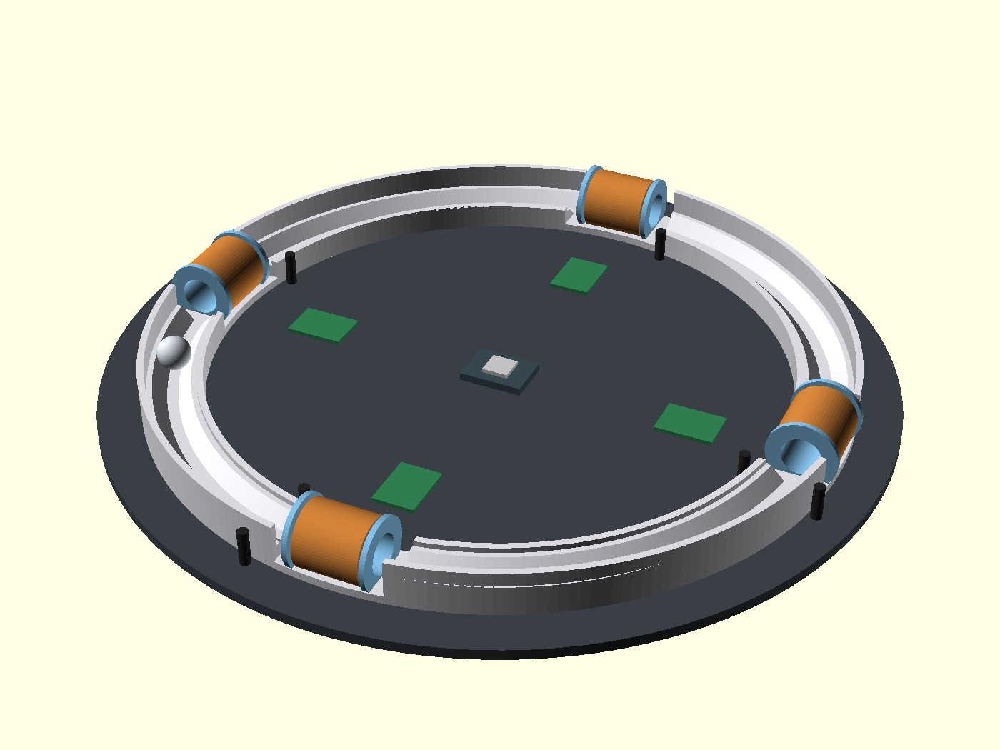

# 電磁環形加速器（Electromagnetic Ring Accelerator）

一個開源科學玩具：鋼球在 3D 列印的環形軌道上，經過線圈加速段被電磁脈衝吸力加速，繞一圈回到原點再次加速，循環往復直到飽和速度。原理是「磁阻式線圈砲（reluctance coilgun）」的環形循環版。

*第一版 3D 概念示意：Ø240 環軌、4 組線圈隧道（銅色）、IR 對射柱（黑）、每級驅動板（綠）與中央 ESP32-S3。模型：[hardware/concept/era_concept_v1.scad](hardware/concept/era_concept_v1.scad)*

> 🚧 專案狀態：**Phase 1 可行性驗證中**——單級直線原型（試配塊已出圖、電路已定稿、韌體已就緒，等待列印與零件到貨實測）。

## 它怎麼運作

1. 線圈通電產生磁場，把鐵磁性鋼球吸向線圈中心，過程中加速。
2. 關鍵在時機：球一過線圈中心，同一個磁場就會反過來拉住它（suck-back）——必須在球到達中心前斷電。
3. 紅外線對射管偵測球接近，ESP32 控制 MOSFET 給線圈一個精準寬度的脈衝。
4. 4 組線圈均布在 Ø240mm 環形軌道上，球每繞一圈被加速 4 次。

有趣的工程發現：在 0.5–3 m/s 的全速域，線圈電流都處於飽和區（τ≈0.65ms 遠短於最短脈寬），所以每級力道都接近上限——調校的重點完全在「關斷時機」，不在電流。

## 規格摘要

| 項目 | 規格 |
|---|---|
| 軌道 | Ø240mm 一體 3D 列印（PETG），45° 雙軌 U 槽 |
| 鋼球 | Ø12.7mm 軸承鋼球（鉻鋼） |
| 線圈 | 0.5mm 漆包線 × 290 匝（8 層），≈1.5Ω / ≈1mH |
| 驅動 | IRLB8721 低邊開關 + SS54 飛輪二極體，12V + 電容組 |
| 感測 | 940nm IR 對射 × 每級 2 道（觸發 + 測速） |
| 控制 | Seeed XIAO ESP32-S3，時序軟體可調 |

## 文件

- [RESEARCH.md](RESEARCH.md) — 原理研究與設計要點
- [PLAN.md](PLAN.md) — 定案方案與階段規劃
- [docs/design-v2-alt.md](docs/design-v2-alt.md) — 方案 B：獨立重新推導的替代設計（傾斜賽道、小球、直線段線圈）與 v1 對照
- [coil-and-driver-spec.md](coil-and-driver-spec.md) — 線圈估算與驅動電路規格（含電路圖）
- [firmware/p1_single_stage/](firmware/p1_single_stage/) — 單級驗證韌體（IR 觸發、脈寬調參、測速、安全保護）
- [docs/log/](docs/log/) — 開發日誌（build log）

## 路線圖

- [x] 原理研究、方案定案
- [x] 試配塊 CAD/STL、電路規格、P1 韌體
- [ ] **Phase 1**：單級直線原型實測（驗證可行性）
- [ ] **Phase 2**：環形軌道 + 4 線圈整合
- [ ] **Phase 3**：測速顯示、玩具化收尾
- [ ] 製作影片與心得分享

## 授權

程式碼採 MIT，文件與硬體設計採 CC BY 4.0。歡迎自由複製改作，註明出處即可。
