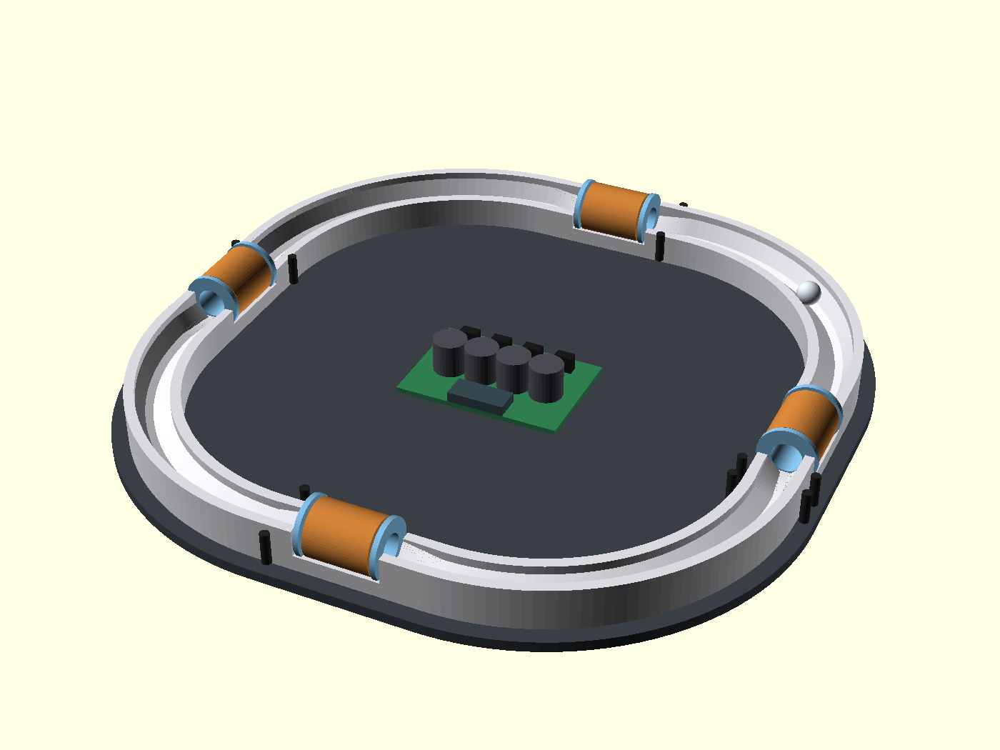
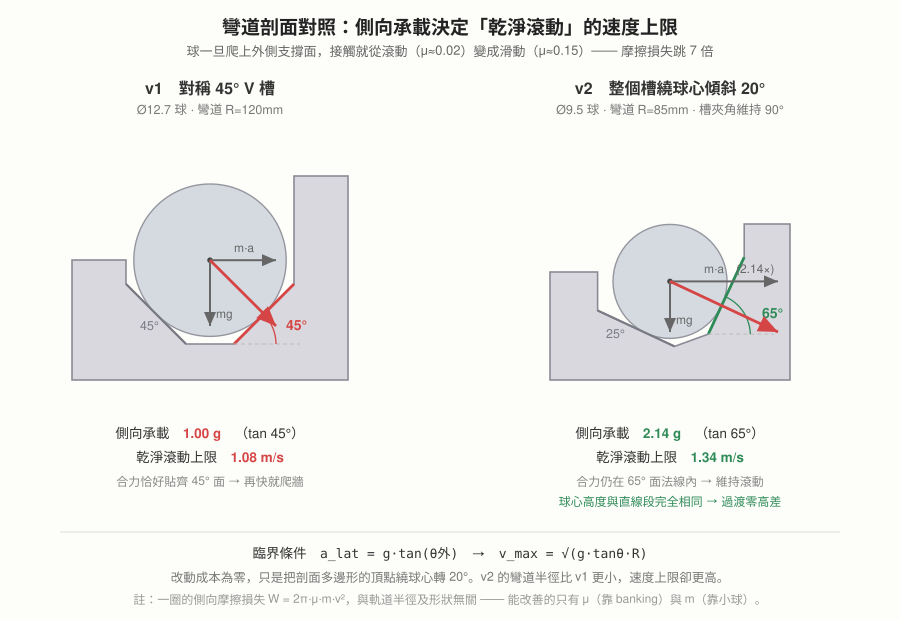
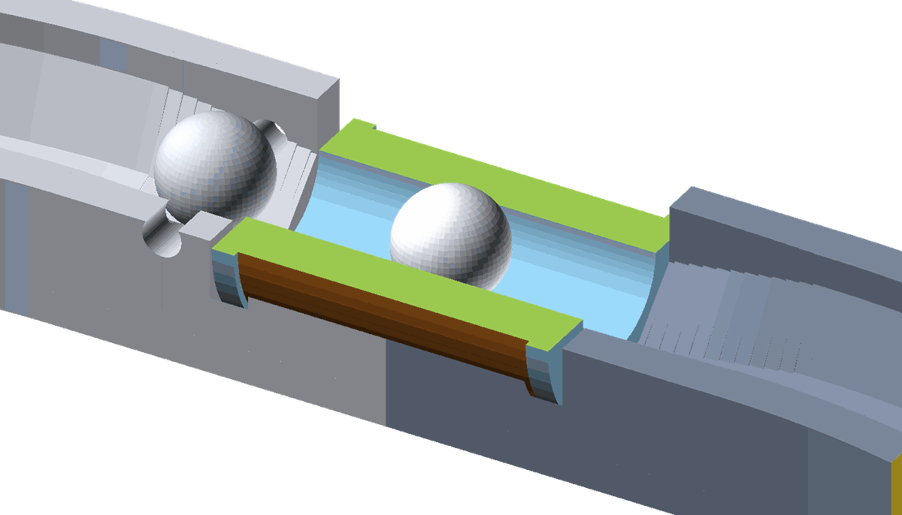

# 方案 B：Banked-Square 4（v2 獨立重新設計）

> 這份是**不參考 v1 結論、從物理重新推導**的第二套設計，目的是與 [PLAN.md](../PLAN.md) 的 v1 方案對照。
> 推導過程中發現五個 v1 未涵蓋的量化問題，列在最前面。結尾有「v1 判斷正確、v2 沿用」的誠實清單。


*方案 B 概念示意：圓角方形軌道（4 直線段 + 4 傾斜彎道）、線圈全在直線段、中央集中驅動板。
模型：[hardware/concept/era_concept_v2.scad](../hardware/concept/era_concept_v2.scad)　俯視圖：[concept_v2_top.png](images/concept_v2_top.png)*

---

## 一、重新推導時發現的三件事

### 發現 1：閉合軌道的側向摩擦損失與軌道形狀完全無關

球轉彎時被外側軌道壁推著轉，側向正壓力 `N = m·v²/r`，沿弧長 `s = r·θ` 積分：

```
W_side = μ·N·s = μ·m·(v²/r)·(r·θ) = μ·m·v²·θ
```

`r` 消掉了。任何閉合迴路 `Σθ = 2π`，所以：

```
W_side = 2π·μ·m·v²   ← 只跟「球重、速度平方、接觸摩擦係數」有關
```

**推論：把軌道做大、做成跑道形、做成圓角方形，一圈的側向摩擦損失一模一樣。**
唯一能真正降低它的手段只有三個：減輕球、降速、**降低 μ**——而降 μ 的正解是**傾斜賽道（banking）**，讓側向力由「滾動的斜面支撐」承擔，而不是「滑動的側牆」。

### 發現 2：v1 的 45° V 槽在 1.08 m/s 就會失效

球騎在 45° 雙斜面上時是滾動接觸（低 μ≈0.02）。但當側向加速度超過斜面能提供的水平分量，球會爬上外壁改成滑動接觸（μ≈0.15，7 倍損失，且噪音與磨耗大增）。



臨界條件：`a_lat = g·tan(θ_外側面)`，`v_max = √(g·tanθ·R)`

| 設計 | 外側支撐角 | 側向承載 | 彎道 R | **乾淨滾動上限速度** |
|---|---|---|---|---|
| v1 | 45° | 1.00 g | 120 mm | **1.08 m/s** |
| v2（banking 20°） | 65° | 2.14 g | 85 mm | **1.34 m/s** |
| v2 極限（banking 25°） | 70° | 2.75 g | 85 mm | 1.52 m/s |

v1 的脈寬對照表涵蓋 0.5–3 m/s，但**物理上球到 1.08 m/s 就會離開 V 槽開始磨外牆**，之後每加速一點都要付 7 倍摩擦。實務巡航速度會卡在 1.1–1.5 m/s 且伴隨明顯磨擦聲。

→ v2 的第一改動：**彎道傾斜賽道（banking）**，成本為零，只是改剖面多邊形的頂點座標。

#### banking 的正確做法：整個 V 槽「繞球心旋轉」

這一步很容易做錯，我第一次也推錯了。兩種做法差很多：

| 做法 | 槽夾角 | 球心高度 | 結果 |
|---|---|---|---|
| ❌ 單獨掰彎兩個面（外 65°／內 35°） | 90°→80° | 比直線段**高 3.34 mm** | 過渡段變成 22% 的陡坡，球會撞上去 |
| ✅ 整個槽繞球心旋轉 20°（外 65°／內 25°） | 維持 90° | **完全不變** | 球心軌跡是水平平面曲線，過渡零高差 |

正解是後者——這正是真實賽車場 banking 的物理意義：**球心的高度與半徑都不動，只有支撐面轉了角度**。
槽的半夾角維持 45°，所以球陷入的深度不變（球心到虛擬頂點恆為 `r√2`）；banking 角 φ 只是把外側面轉成 `45°+φ`、內側面轉成 `45°−φ`。

側向承載只由外側面角度決定，所以承載提升的好處完整保留，而過渡問題自動消失。
φ 上限約 40°（內側面接近水平會失去停放穩定性），實用取 20–25°。

#### 發現 2b：隧道孔心不等於球心（stl 於出圖時抓出，2026-07-28）

我第一版派工單把隧道孔心寫成「= 球心高 8.218」，這是錯的。球在 bobbin 內孔裡是**躺在孔底滾**，不是懸浮在孔軸上：

```
球心 = 孔心 − (孔徑 − 球徑)/2 = 孔心 − (11.2 − 9.5)/2 = 孔心 − 0.85
→ 要讓球心維持 8.218，孔心必須是 9.068
```

若照原派工做，球一進隧道就會**跌落 0.85mm**——正好發生在加速段，是最不該有擾動的地方。

諷刺的是 v1 早就處理對了：`BALL_Z=9.98`、`BORE_Z=10.88`，差 0.90 = (14.5−12.7)/2。
我在 v2 沿用這段幾何時把這個關係弄丟了，寫成了 `BORE_Z = BALL_Z`。**這是 v1 做對、v2 一度做錯的一項。**

連帶修正：法蘭 Ø22 的下緣落在 `9.068 − 11 = −1.93mm`，低於底板基準面，法蘭會穿出底板。

**stl 定案（2026-07-28）：全周底板 3 → 6mm**。

推理過程值得記下來，因為前兩個直覺解都不行：

| 做法 | 為什麼不行 |
|---|---|
| 側面加肉 | 法蘭要的是基準面**下方**的空間，側面加肉在同一 z 範圍，沒用 |
| 只加厚線圈區 | 底面不再是同一平面，253mm 一體大件貼床不均會翹 |
| **全周底板 3→6** ✅ | 底面維持同一平面、貼床面積不減，法蘭槽開在 6mm 厚度裡 |

幾何一律不動，只是底面從 z=0 整體下移到 z=−3。
代價約 +58g（774mm 路徑 × 20 寬 × 3 厚，實心估），換來整圈剛性提升與零翹曲風險。

#### 但加厚還是不夠——最後靠 D 形法蘭釜底抽薪

底板加到 6mm 之後我再算一次膜厚，還是不對：

```
法蘭下緣 −1.932，沉槽挖到 −2.23（含餘裕），底面 −3
→ 剩餘膜厚僅 0.77mm      ← 在磁隙最敏感處，不可接受
```

問題的根源是**法蘭半徑 11 大於孔心到基準面的距離 6.068**，所以圓法蘭必然伸進基準面以下 4.93mm，
底板加多厚都只是把這 4.93mm 往下推，膜厚不會變。

**最終解（stl 定案）：法蘭改 D 形**——下緣截平於基準面下 0.5（z=2.5），沉槽只需挖到基準面下 0.8 的淺槽：

```
截平線距圓心 = 9.068 − 2.5 = 6.568
弦半寬 = √(11² − 6.568²) = 8.82  →  法蘭外形 22 × 17.6
底膜 = 5.20mm（stl CAD 取樣柱量測）
```

從「加厚以容納法蘭」變成「削掉法蘭用不到的部分」，膜厚問題直接消失。
D 形對立印姿態沒有影響。

#### 繞線注意：這副法蘭本來就擋不住線，D 形只是讓它更明顯

D 形的有效擋線角度值得算清楚。線圈外徑 20.8（半徑 10.4），法蘭半徑 11：

```
法蘭邊緣要高過線圈外緣，需距圓心 ≥ 10.4
截平弦上距中點 s 的點，距圓心 = √(6.568² + s²)
  → 需 s ≥ √(10.4² − 6.568²) = 8.06，而弦半長只有 8.82
無擋線角度 = 2·asin(8.06/11) = 94.2°  →  有效擋線 265.8°
```

而且缺口最低點的法蘭半徑 6.568，只比 bobbin 筒身半徑 6.4 高出 **0.168mm**——那一段等於完全沒有側擋。

不過真正的重點是：**即使用完整圓法蘭，裕度也只有 (11 − 10.4) = 0.6mm**，對 0.5mm 漆包線
只夠擋一層多一點。這副 bobbin 從一開始就不是靠法蘭擋線的，是靠繞線張力；D 形只是把這件事挑明。

→ 繞線務必**全程保持張力**，繞完立刻用膠帶／熱縮套／少量瞬間膠固定端頭，不要指望法蘭。
→ 若實測發現線容易鬆脫，截平位置可下修：`z_cut` 越低法蘭越完整，代價是底膜變薄。

| z_cut | 底膜 | 無擋線角度 |
|---|---|---|
| 2.5（現行） | 5.20 mm | 94.2° |
| 1.5 | 4.2 mm | 80.8° |
| ≤ 0.12 | — | 弦半寬會小於筒身半徑，法蘭切進筒身，不可用 |

#### 通則：凡是「圓的東西躺在圓孔裡」，孔心都要抬半個間隙

孔心那個錯不是一次性的失誤——同一個關係在這個專案裡出現了**三次**，其中兩次是 bug：

```
孔心 = 物體軸心 + (孔徑 − 物體徑) / 2
```

| 應用 | 孔徑 / 物體 | 孔心 | 物體軸心 |
|---|---|---|---|
| bobbin 內孔 / 鋼球 | 11.2 / 9.5 | **12.068** | 11.218 |
| IR 夾座槽 / 對射管 | 3.2 / 3.0 | **11.100** | 11.000 |
| ❌ 光路孔誤當定位槽 | 3.5 / 3.0 | 11.000 | **10.750**（偏低 0.25） |

第三列是 stl 在做 IR 夾座時自己踩到並修掉的：光路孔 Ø3.5 一路打穿夾座立柱，
而它比定位槽 Ø3.2 大、孔底（9.25）比槽底（9.5）低，元件會滑進去落到孔底，光軸偏低 0.25mm。
修法是**讓光路孔止於軌道外緣 ±10.5、不進立柱**（實測 STL 頂點確認孔底只到 |x|=10.500 ✓）。

會重複踩到是因為這個關係違反直覺——直覺會說「讓孔心對準物體要走的高度」，
但物體是**躺在孔底**的，不是懸在孔心。定位面是孔的底部，不是孔的軸線。

> 檢查方法：問「這個東西靠什麼面定位？」如果答案是孔的底部，那孔心就不等於物體軸心。

#### 順帶：v1 概念圖的剖面與它自己的球心算式對不上

檢查 `hardware/concept/era_concept_v1.scad` 的 `track_profile()` 多邊形時發現：

```
外側斜面 [20.5,8] → [13.5,3]：Δx=7、Δz=5  →  35.5°   ← 不是 45°
內側斜面 [9.5,3]  → [4.5,8] ：Δx=5、Δz=5  →  45°
```

但同一份檔案的 `BALL_Z = 9.98` 是按**對稱 45°** 算出來的（`r√2 − 平底半寬 + 底板 = 6.35×1.4142 − 2 + 3 = 9.98`）。
兩者不一致，而且錯的方向最不利——**外側比內側還緩**，正好是離心力要壓過去的那一面。

**已向 stl 確認（2026-07-28）：正式件的出圖一直是對稱 45°（Δx=5/Δz=5，與球心 9.98 自洽），
35.5° 只存在於我們的 `era_concept_v1.scad` 示意檔中。**
根因是外側漏了斜面頂點 `[18.5,8]`，多邊形從 `[20.5,8]` 直接連到 `[13.5,3]`。已補上並重新渲染，
v1 的設計本身沒有問題。

### 發現 3：Ø240 圓環上放 30mm 直線圈，球一定會撞隧道壁

直 bobbin 的軸線是圓的**弦**，球從弧形軌道出來時速度沿**切線**，兩者夾角：

```
α = asin(L/2R) = asin(15/120) = 7.18°
30mm 行程的橫向漂移 = 30 × tan(7.18°) = 3.78 mm
隧道總間隙 = 14.5 − 12.7 = 1.8 mm      ← 漂移是間隙的 2.1 倍
```

球會斜著撞進隧道口、沿壁刮擦通過，動能損失與噪音都在最不該發生的地方（加速段）。縮短線圈到 12mm 才勉強達標，但那樣安匝與加速行程都不夠。

→ v2 的第二改動：**軌道改圓角方形，線圈全部放在直線段**，入口角歸零。
（備選：把 bobbin 做成弧形骨架沿 R=120 彎曲，也能解，但手繞弧形筒麻煩。）

---

## 二、第四個發現：恆壓驅動下「安匝與匝數無關」

磁阻力正比於安匝數平方 `(N·I)²`。恆壓驅動時 `I = V/R`，而 `R = ρ·N·l_turn/A`：

```
N·I = N · V·A/(ρ·N·l_turn) = V·A / (ρ·l_turn)
                              ↑ N 消掉了
```

**安匝只由「電壓、線徑截面、平均匝長」決定，繞幾匝完全不影響力道。**
匝數只決定電流大小與電感（響應速度），不決定推力。

這帶來 v2 最大的免費性能槓桿——**把球變小**：

| | v1（Ø12.7 球） | v2（Ø9.5 球） |
|---|---|---|
| 球質量 | 8.38 g | **3.52 g**（0.42×）|
| bobbin 內孔 | 14.5 mm | 11.2 mm |
| 線圈平均匝徑 | 20.0 mm | 15.6 mm |
| 平均匝長 | 62.8 mm | 49.0 mm |
| **安匝（12V、0.5mm 線）** | 2 180 At | **3 200 At**（1.47×）|
| 磁阻力 ∝ (NI)² | 1.00 | **2.15×** |
| **加速度 = 力/質量** | 1.00 | **5.1×** |

球小 → 線圈小 → 匝長短 → 同樣線徑同樣電壓下電阻低、電流大、安匝反而多；同時質量掉一半以上。**加速度提升 5 倍，而且鋼球更便宜、漆包線更省。**

代價：小球對軌道層紋與接縫更敏感（同樣 0.2mm 台階，對 9.5mm 球是相對 2.1% 的障礙，對 12.7mm 球是 1.6%），軌道表面品質要求提高。

---

## 三、第五個發現：v1 的電容組電荷帳沒算過

v1 寫「線圈旁並 2200–4700µF 供脈衝峰值」。實際算一次電荷：

```
單脈衝電荷 Q = I × w = 8A × 10ms = 80 mC
12V/5A 電源在脈衝期間只能供 5A × 10ms = 50 mC
電容必須補 30 mC
```

若只裝 2 顆 2200µF（4400µF），壓降 = 30mC / 4.4mF = **6.8V** → 電壓垮掉一半，力道剩 1/4。

正確做法是把電容組加大並**集中並聯**（4 級不會同時開，分散裝反而各自不夠）：

| 電容組 | v1 @8A/10ms 壓降 | v2 @11A/7ms 壓降 |
|---|---|---|
| 4 400 µF | 6.8 V ❌ | 9.5 V ❌ |
| 9 400 µF | 3.2 V ⚠️ | 4.5 V ⚠️ |
| **18 800 µF（4700×4 並聯）** | **1.6 V ✅** | **2.2 V ✅** |

充電恢復：每級每圈觸發一次（約 0.6s 一次），補 42mC 只需 8.4ms，5A 電源綽綽有餘。

→ v2 明確規定：**4700µF/25V 低 ESR × 4 全部並聯在集中驅動板上**，不分散。
（好消息：v1 採購清單第 5 項本來就寫「2–4 顆」，買到 4 顆就對了，這項不用改單。）

---

## 四、v2 規格表

| 項目 | 規格 | 理由 |
|---|---|---|
| **佈局** | 圓角方形：直線段 60mm ×4 + 彎道 R=85mm ×4（90°），彎心在 (±30, ±30) | 線圈全在直線段，入口角 0° |
| 外廓 / 周長 | 253 × 253 mm / 774 mm | 256 床單件一體印，仍無接縫 |
| **剖面（直線段）** | 對稱 45° V 槽，平底寬 3mm，球心高 5.218mm（相對槽底） | 停放穩定、進出線圈對中 |
| **剖面（彎道）** | 同一個槽繞球心旋轉 20°：外側面 65°、內側面 25°，**球心高度與半徑不變** | 側向承載 2.14g，過渡零高差 |
| **緩和段** | 直線段兩端各 15mm，僅 banking 角 0°→20° 線性漸變（線圈只用中間 30mm） | 球心軌跡全程是水平平面曲線 |
| 鋼球 | **Ø9.5mm（3/8")** 鉻鋼 GCr15，3.52g | 加速度 5.1×、摩擦損失 0.42× |
| bobbin | 內孔 11.2mm、壁 0.8mm、長 30mm、**D 形法蘭 22×17.6**（下緣截平於基準面下 0.5） | 磁隙 0.85mm/邊；截平換來 5.2mm 底膜 |
| **隧道孔心高** | **9.068mm**（= 球心 8.218 + 間隙/2 0.85） | 球躺孔底滾，不是懸在孔心 |
| 底板 | **全周 3 → 6mm**（幾何不動，底面整體下移至 z=−3） | 法蘭需要基準面下方空間；只加厚線圈區會讓底面不平 |
| 線圈 | 0.5mm 漆包線 × 290 匝（8 層），≈1.09Ω / ≈0.6mH，τ≈0.55ms | 安匝 3200 At、峰值 ~10–11A |
| 續流二極體 | **MBR1045 / SB1045（10A/45V）**，或 SS54 ×2 並聯 | 11A 超過 SS54 的 5A 連續額定 |
| 電容組 | 4700µF/25V 低 ESR **×4 並聯，集中** | 見發現 5 |
| 電源 | 12V / 5A（沿用） | 平均功耗僅 ~0.13A，只有瞬時問題，已由電容解決 |
| MOSFET | IRLB8721 ×4（沿用），免散熱片 | 11A×12mΩ×1.2% duty = 0.02W 平均 |
| **感測** | 每級 1 道 IR 觸發（4 對）+ 基準級加 1 道測速（共 **5 對**） | 見下 |
| 控制 | XIAO ESP32-S3（沿用），**非阻塞 esp_timer 時序** | 4 級並行不能用 busy-wait |
| 脈寬起手 | d_eff≈8mm → w ≈ 8/v ms（1.0m/s→8ms、1.34→6ms、0.5→16ms） | |

### 感測方案簡化

v1 每級 2 道 IR = 8 對、16 個對穿孔。v2 改成：

- **每級 1 道觸發 IR**（球到 → 延遲 d → 脈寬 w）
- **速度由級間飛行時間反推**：級距固定 193.5mm，第 N 級與第 N−1 級觸發時戳相減即得平均速度
- **保留 1 級雙 IR** 作為速度標定基準（校正級間法的系統偏差）

省一半接線與孔位，且環形本來就在循環，速度資訊天然存在。
代價：級間法測的是「上一段平均速度」，加速期會略低估 → 脈寬偏長 → 有 suck-back 風險，所以保留基準級做校正。

### 必須新增：軟體限速（巡航控制）

v2 加速度是 v1 的 5 倍，球會一路加速直到撞上 banking 上限 1.34 m/s 然後開始磨外牆。
因此韌體必須做：**測得速度 ≥ 目標速度時跳過該級脈衝**。

這反而是玩具的賣點——可以做「設定巡航速度」、OLED 顯示即時速度、加減速展示。v1 因為推力小可能自然平衡，v2 是主動控制。

---

## 四之二、分件架構選項：「縫藏隧道」

一體印和分件卡榫本來是矛盾的——v2 從一開始就主張一體無縫（鋼球對 0.1mm 台階敏感）。
但 David 提出正式件分件的需求後，stl 找到了調和方案：

**把接縫藏在球摸不到的地方。**


*綠色是 bobbin、藍色是內孔。軌道在線圈段正中斷開，球在隧道內全程騎 bobbin 內孔，摸不到接縫。*

軌道在**線圈段正中**斷開。球通過該處時正在 bobbin 內孔裡（bobbin 長 30，接縫在正中，
球半徑 4.75，兩端各有 15mm 餘裕），接觸的是 bobbin 內孔面而不是軌道——**接縫對球不存在**。

| | 一體印（combo 路線） | 四角件（joint 路線） |
|---|---|---|
| 尺寸 | 253×253 一件 | 4 件各約 145×145 |
| 印壞成本 | 整件報廢 | 重印一角 |
| 翹曲風險 | 大件風險高 | 小件風險低 |
| 接縫 | 無 | 4 個，都藏在隧道內 |
| 對位 | 不需要 | 底部燕尾舌（0.4 間隙）+ bobbin 兼對位銷 |
| 額外需求 | 無 | 需底座提供剛性基準 |

分件版的接合設計（實測 `test_v2_joint_a/b`）：接縫面在 y=30，燕尾搭接 9mm。
**燕尾正上方就是線圈坑**，所以舌中央只有 1.25mm 厚、倒鉤區 2.5–3.0mm，鎖定作用在倒鉤區。
→ stl 建議正式件配底座螺絲，不讓燕尾吃結構力。這個定位是對的：
**燕尾負責對位、螺絲負責承力**，加上 bobbin 本身跨縫兼對位銷，等於三重定位。

### 這裡有一個幾何必然，改不掉

線圈區的底膜只有 **1.268mm**（實測），因為線圈 Ø20.8 的最低點在 z=1.668，
比法蘭 D 面（z=5.5）還低 3.83mm——法蘭區能靠 D 形截平把底膜救回 5.35，
**線圈區沒有這個餘地**。該區剛性要算兩側側牆，不能算底膜。

而分件版的 4 個接縫，正好都落在這個最薄的位置上。這是分件方案要用實測回答的問題。

### 建議的決策方式

不必現在二選一——兩版共用同一個參數化模型，切不切只是一個開關。
合理的做法是 **迭代期用分件**（印壞重印一角，改設計成本低），
**確認幾何全對之後，展示件用一體印**（無縫、最可靠）。
David 的 Bambu H2D（300×320×320）床夠大，一體印始終是可行選項。

## 五、v1 vs v2 對照

| | v1（Ring-4） | v2（Banked-Square 4） | 差異來源 |
|---|---|---|---|
| 軌道形狀 | Ø240 正圓環 | 253mm 圓角方形（直線+彎道） | 發現 3 |
| 線圈入口角 | 7.18°（漂移 3.78mm > 間隙 1.8mm）❌ | 0° ✅ | 發現 3 |
| 剖面 | 全程對稱 45° | 直線 45°／彎道 banking 20°（65°+25°） | 發現 1、2 |
| 乾淨滾動上限 | 1.08 m/s | 1.34 m/s | 發現 2 |
| 鋼球 | Ø12.7 / 8.38g | Ø9.5 / 3.52g | 發現 4 |
| 安匝 | 2 180 At | 3 200 At | 發現 4 |
| 加速度 | 1× | **5.1×** | 發現 4 |
| 每圈摩擦損失 @1.0m/s | ≈2.0 mJ | ≈0.9 mJ | 發現 1、4 |
| IR 對數 | 8 | 5 | 級間測速 |
| 驅動板 | 4 片分散 + 星狀接地 | 1 片集中，單點接地 | 除錯與接地品質 |
| 電容 | 2–4 顆分散 | 4 顆集中並聯（18800µF） | 發現 5 |
| 續流二極體 | SS54（5A） | MBR1045（10A）或 SS54×2 | 峰值 11A |
| 韌體時序 | 阻塞式 busy-wait | 非阻塞 esp_timer × 4 級 | Phase 2 必要 |
| 速度控制 | 無（自然平衡） | 主動限速巡航 | 推力過剩 |
| 周長 | 754 mm | 774 mm | — |

## 六、v1 判斷正確、v2 原封沿用

不為了不同而不同。以下 v1 的決策我重新算過，結論是它對：

- **磁阻式 + IR 觸發 + MOSFET 低邊開關**——這個架構本身沒有更好的替代
- **12V 而非高壓電容放電**——科學玩具的安全性遠比極致速度重要，且循環補能不需要大能量
- **IRLB8721**（3.3V 真 logic-level，TO-220 好焊）
- **一體列印無接縫**（鋼球對 0.1mm 台階極敏感，這個判斷完全正確）
- **PETG 而非 PLA**（線圈發熱，PLA 55°C 會軟）
- **IR 光電晶體集極輸出 + 內部上拉，遮光/斷線皆 HIGH**——fail-safe 極性選得漂亮，這是全案最好的一個決策
- **T5A 慢熔保險絲、電容組接在保險絲之後**
- **12V/5A 電源**（重算平均功耗僅 0.13A，v1 選型沒問題，問題只在電容量）
- **0.5mm 漆包線 8 層**（線徑是安匝的主要槓桿，0.5 是繞線手感與安匝的甜蜜點）

---

## 七、對已完成工作與採購的影響

| 項目 | 影響 | 說明 |
|---|---|---|
| 漆包線 0.5mm ×2 捲 | ✅ 不變 | v2 線更省（匝長短 22%）|
| IRLB8721 ×6 | ✅ 不變 | |
| IR 對射管 ×8 對 | ✅ 不變 | v2 只用 5 對，更寬裕 |
| 電容 2200–4700µF | ⚠️ **改買 4700µF ×4** | 原「2–4 顆」→ 明確 4 顆 4700 |
| 12V/5A 電源、T5A 保險絲 | ✅ 不變 | |
| **鋼球 12.7mm** | ❌ **改 9.5mm（3/8"）** | 尚未下單，現在改零成本 |
| **SS54 ×6** | ⚠️ **加購 MBR1045 ×6** 或 SS54 買 12 顆並聯 | 峰值 11A |
| 電阻包 | ✅ 不變 | 100Ω / 10kΩ 需求相同 |
| 洞洞板 | ⚠️ 改買 1 片大板（7×9cm）取代 4 小片 | 集中驅動板 |
| **試配塊 STL** | ❌ **需重出**：bobbin 內孔 11.2、軌道改 banked 剖面 | 若尚未列印，等新檔 |
| P1 韌體 | ⚠️ 參數改（d_eff 8mm、脈寬表重算），架構不變 | 單級驗證邏輯完全可沿用 |
| coil-and-driver-spec.md | ⚠️ 線圈參數需重算（1.09Ω / 0.6mH / 11A） | |

## 八、v2 未驗證的風險（誠實列出）

1. **9.5mm 小球對列印表面品質更敏感**——若試印後滾動不順，回退 12.7mm 只需放大 bobbin 內孔與槽寬，banking 設計不受影響。
2. **65° 外側面的實際 μ**——理論上仍是滾動接觸，但接觸點靠近球赤道時差速滑移增加，實測可能比 0.02 高。
3. **緩和段仍有「扭轉」**——球心高度不變了，但槽面在 15mm 內轉 20°，球與槽的接觸點會沿球面移動，可能有輕微的滾動軸擾動。做長到 20–25mm 更保險。
4. **圓角方形 + banking 的 SCAD 建模比 rotate_extrude 複雜**——需要直段 linear_extrude + 彎道 rotate_extrude + 漸變段分段內插拼接（概念圖用 15 片近似），正式件應改用連續掃掠，出圖工時較高。
5. **11A 峰值下的線圈溫升**——132W 瞬時、1.2% duty → 平均 1.6W，估計溫升 20–30°C，PETG 安全，但連續高速運轉需實測。
6. **級間飛行時間測速在加速期會低估**——已用基準級校正，但第一圈仍需保守長脈寬冷啟動。

---

*本文件為 v2 獨立設計提案，與 v1 並存供比較，未取代 [PLAN.md](../PLAN.md)。*
